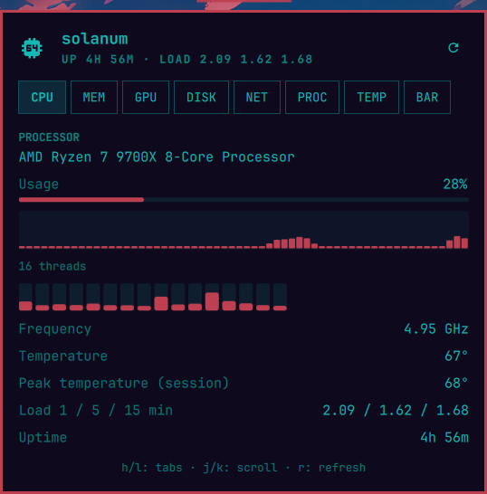
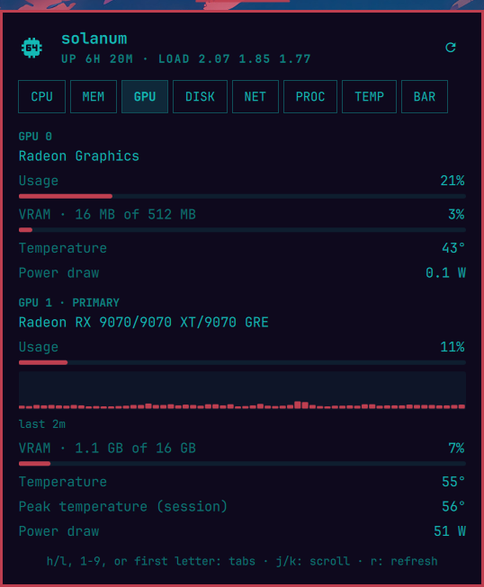
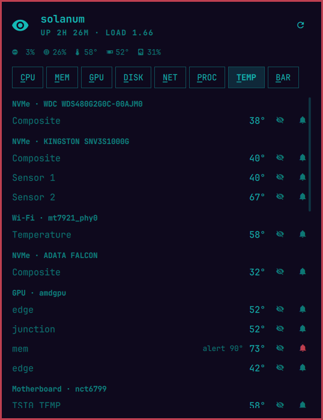
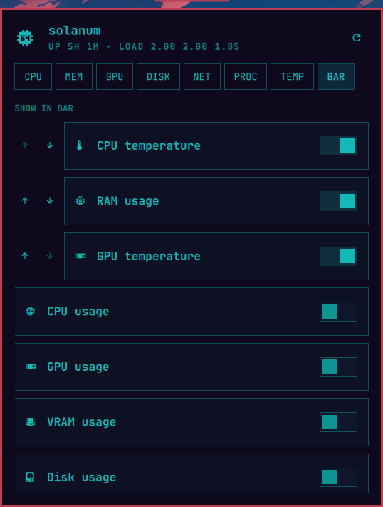
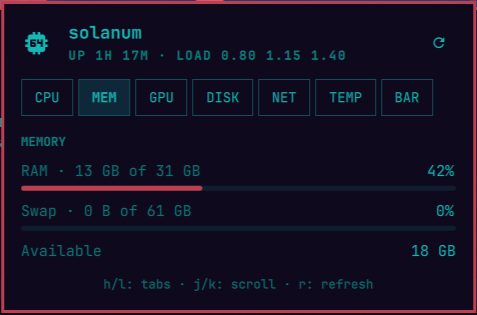
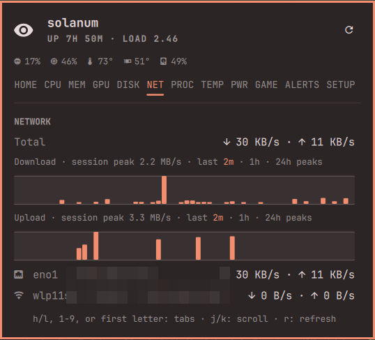
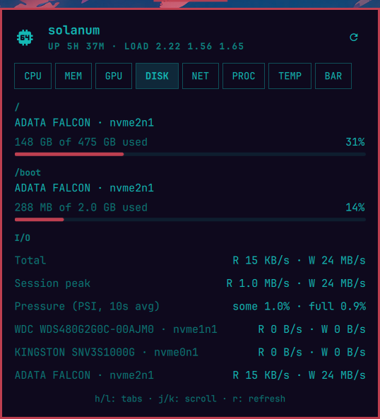

# Argus — System Monitor for Omarchy

Argus is a bar widget for the [Omarchy](https://omarchy.org) shell that shows live
system stats in the bar — you pick which — and opens a tabbed panel with the
full picture.


## Bar metrics (all selectable)

CPU usage, CPU temperature, RAM usage, GPU usage, GPU temperature, VRAM
usage, disk usage, network throughput, and load average. Pick any subset in
the panel's **BAR** tab; the choice persists to `~/.config/omarchy/shell.json`.

## Panel tabs

- **CPU** — processor model, overall usage, per-thread bars, frequency, temperature, load, uptime
- **MEM** — RAM and swap usage
- **GPU** — every GPU (amdgpu sysfs): name, usage, VRAM, temperature
- **DISK** — every real filesystem with its physical disk model (LUKS/LVM resolved via lsblk)
- **NET** — per-interface download/upload rates
- **TEMP** — every hwmon sensor with friendly names (CPU, GPU, NVMe with drive model, RAM, Wi-Fi, …)
- **BAR** — toggles for which metrics the bar shows

| | |
|---|---|
|  |  |
|  |  |
|  |  |
|  | |

## Interactions

- Bar button: left click opens the panel, middle click refreshes, right click launches btop
- Panel: `h`/`l` or ←/→ switch tabs, `j`/`k` or ↑/↓ scroll, `r` refreshes, `Esc` closes

## Install

```bash
git clone https://github.com/diegopluna/omarchy-argus \
  ~/.config/omarchy/plugins/io.github.diegopluna.argus
omarchy plugin enable io.github.diegopluna.argus
```

Requires only tools an Omarchy install already has: `bash`, `coreutils`,
`df`, `lsblk` (util-linux), and `lspci` (pciutils) for GPU names. `btop` is
optional (right-click launch).

## Uninstall

```bash
omarchy plugin disable io.github.diegopluna.argus
rm -rf ~/.config/omarchy/plugins/io.github.diegopluna.argus
```

Disabling removes the widget from the bar; the only state Argus writes is
its own entry in `~/.config/omarchy/shell.json`.

## Settings

Inline settings on the widget's entry in `shell.json`:

| Key | Default | Meaning |
|---|---|---|
| `show` | `["cpu", "ram", "cputemp"]` | Ordered metric keys shown in the bar |
| `intervalSec` | `2` | Poll interval in seconds (1–60) |
| `diskMount` | `/` | Mount point used by the bar's disk metric |

## IPC

```bash
omarchy-shell io.github.diegopluna.argus toggle
omarchy-shell io.github.diegopluna.argus refresh
omarchy-shell io.github.diegopluna.argus tab TEMP
```

## Data sources

`/proc` (stat, meminfo, loadavg, uptime, net/dev, cpuinfo), `df`, `lsblk`,
`/sys/class/hwmon` for temperatures, and `/sys/class/drm/card*/device` for
GPU busy/VRAM (amdgpu; no NVIDIA driver support yet). One short bash sampler
runs per refresh; usage deltas are computed in QML.
