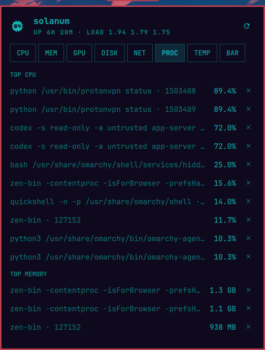

# Argus — System Monitor for Omarchy

Argus is a bar widget for the [Omarchy](https://omarchy.org) shell that shows live
system stats in the bar — you pick which, in the order you want — and opens a
tabbed panel with the full picture. Bar segments switch to the theme's urgent
color when a metric crosses its threshold.


## Bar metrics (all selectable, reorderable)

CPU usage, CPU temperature, RAM usage, GPU usage, GPU temperature, VRAM
usage, disk usage, disk I/O, network throughput, load average, and battery
(shown only on machines that have one). Pick any subset and arrange the
order in the panel's **BAR** tab; the choice persists to
`~/.config/omarchy/shell.json`.

## Panel tabs

- **CPU** — processor model, overall usage with sparkline history, per-thread bars, frequency, temperature with session peak, load, uptime, stall pressure, kernel version
- **MEM** — RAM usage with sparkline history, swap, PSI memory pressure
- **GPU** — every GPU (AMD via amdgpu sysfs, NVIDIA via nvidia-smi, Intel via hwmon): name, usage with sparkline history, VRAM, temperature with session peak, power draw, and each card's busiest processes with GPU usage and VRAM (via DRM fdinfo; not available for the proprietary NVIDIA driver). An AMD iGPU's memory meter covers its real pool — the BIOS carve-out plus GTT (shared system RAM) — not just the misleading carve-out, with the split shown underneath
- **DISK** — every real filesystem with its physical disk model (LUKS/LVM resolved via lsblk), live read/write rates per physical disk, PSI I/O pressure, and per-drive SMART health (wear, power-on time, warnings) via udisks2 — a failing or worn-out drive turns urgent, and notifies once per session when its alert is enabled
- **NET** — total and per-interface download/upload rates, with download/upload sparklines; virtual interfaces (VPN tunnels, bridges, veth) are listed but kept out of the totals so VPN traffic isn't counted twice
- **PROC** — top processes by CPU and by memory (full command lines), each with a terminate button (SIGTERM, after confirmation)
- **TEMP** — every hwmon sensor, grouped by device with friendly names (CPU, GPU, NVMe with drive model, RAM, Wi-Fi, …), plus fan speeds; each sensor row can carry its own alert threshold, set inline, and noisy sensors can be hidden (hidden sensors keep alerting)
- **BAT** — per-battery charge, status, power draw, health, and time estimate (tab appears only when a system battery exists)
- **ALERTS** — every alert with its opt-in toggle and inline threshold stepper (all off by default), plus the last few fired alerts with timestamps
- **BAR** — toggles and reorder arrows for which metrics the bar shows, and Argus's own measured sampling cost

A watch row under the host name keeps every vital — CPU, RAM, CPU/GPU
temperature, disk, battery — visible on every tab. A vital turns urgent
with its metric, and clicking one jumps to the tab that explains it.

Sparklines cover the last ~2 minutes at full resolution; click any chart
caption to switch every chart to a 1-hour view where each bar is that
minute's peak — peaks, not averages, so spikes survive the zoom-out.

PSI "stall pressure" (`/proc/pressure`, shown over the 10s/1m/5m windows
like a load average) is the share of time tasks spent *waiting* on a
contended resource — it is not usage. On a healthy machine it reads 0
however busy the CPU is; it only rises when work actually queues (more
runnable tasks than cores, memory reclaim, saturated disk).

| | |
|---|---|
|  |  |
|  |  |
|  |  |
|  |  |

## Interactions

- Bar button: left click opens the panel, middle click refreshes, right click launches btop
- Panel: `h`/`l` or ←/→ switch tabs, `1`–`9` or a tab's first letter jump straight to it, `j`/`k` or ↑/↓ scroll, `r` refreshes, `Esc` closes
- Opening the panel while a metric is urgent lands on the tab that explains it

## Install

```bash
git clone https://github.com/diegopluna/omarchy-argus \
  ~/.config/omarchy/plugins/io.github.diegopluna.argus
omarchy plugin enable io.github.diegopluna.argus
```

Requires only tools an Omarchy install already has: `bash`, `coreutils`,
`df`, `ps` (procps), `lsblk` (util-linux), and `lspci` (pciutils) for GPU
names. On NVIDIA systems, `nvidia-smi` (which ships with the driver)
provides GPU stats. `btop` is optional (right-click launch).

## Uninstall

```bash
omarchy plugin disable io.github.diegopluna.argus
rm -rf ~/.config/omarchy/plugins/io.github.diegopluna.argus
```

Disabling removes the widget from the bar; the only state Argus writes is
its own entry in `~/.config/omarchy/shell.json`.

## Settings

Inline settings on the widget's entry in `shell.json`:

| Key | Default | Meaning |
|---|---|---|
| `show` | `["cpu", "ram", "cputemp"]` | Metric keys shown in the bar, in display order |
| `intervalSec` | `2` | Poll interval in seconds (1–60) |
| `diskMount` | `/` | Mount point used by the bar's disk metric |
| `alerts` | `"On"` | Master switch over every alert notification |
| `alertCommand` | — | Shell command run on every fired alert (see below) |
| `alertsOn` | `[]` | Alert keys the user toggled on (edited from the ALERTS tab) |

Urgent thresholds — one per metric (`urgentCpuPct`, `urgentCpuTempC`,
`urgentMemPct`, `urgentGpuPct`, `urgentGpuTempC`, `urgentVramPct`,
`urgentDiskPct`, `urgentDriveTempC`, `urgentBatPct`, `urgentWearPct`) —
are edited from the panel's **ALERTS** tab and persist as inline settings
alongside the keys above. They are per component because different
silicon has different comfort zones: GPUs run hot by design, SSDs
throttle early. Pre-0.9.0 configs keep working: the old shared CPU/RAM
values still cover GPU/VRAM until their own are set, and the pre-0.5.0
single `urgentTempC` still falls back for the CPU/GPU temperatures.
Load average turns urgent when the 1-minute load reaches the thread
count. Drive temperature is alert-only (it has no bar segment) and
watches the hottest NVMe/SATA sensor.

## Alerts

Every alert is **off by default**. The ALERTS tab lists them — CPU usage,
CPU temperature, RAM, GPU usage/temperature, VRAM, disk usage, drive
temperature, battery low, drive health — each with a toggle, the live
reading it watches ("now 43%"), and its threshold, editable inline
(−/+ stepper). Thresholds color bar segments
and panel rows urgent whether or not the alert is on; the toggle adds
the notification.

A toggled-on metric that stays past its threshold for three consecutive
ticks fires one desktop notification (via `notify-send`, so it renders
through the Omarchy shell). Temperature and battery alerts use critical
urgency; usage alerts are normal. Each metric then stays quiet for a
5-minute cooldown. Alerts evaluate every sampled metric, whether or not
its bar segment is shown.

CPU and memory alerts name their likely culprit — *"CPU usage at 100%
(threshold 90%) — chromium 61%"* — from a process snapshot taken the
moment the alert fires. With the drive-health alert on, a drive whose
SMART health turns bad (critical warning, wear past the configurable
alarm level, or media errors) alerts once per session.

The last ten fired alerts are kept, with timestamps, at the bottom of the
ALERTS tab — for the "did anything trip while I was away?" question that a
vanished notification can't answer — and the CPU/MEM/GPU sparklines mark
where in the history each alert fired.

On top of the default thresholds, **any individual sensor** can carry its
own alert threshold, set from the TEMP tab: the 󰂚 button on a sensor row
opens a stepper (−/+/off). A sensor over its limit renders its row in the
urgent color and fires a notification with the usual 3-tick hold and
cooldown. These persist in shell.json as a `sensorThresholds` map keyed by
`chip|device|label`, so they survive reboots and hwmon renumbering.

### Alert hook

`alertCommand` runs on every fired alert (in addition to the desktop
notification), with the alert's details in environment variables:
`ARGUS_ALERT_KEY` (metric key, `sensor:…`, or `drivehealth`),
`ARGUS_ALERT_TEXT` (the full message, attribution included),
`ARGUS_ALERT_CRITICAL` (`1`/`0`), and `ARGUS_ALERT_AT` (epoch ms). One
setting turns alerts into automation — log them, push them to a phone,
page a webhook:

```json
"alertCommand": "curl -s -d \"$ARGUS_ALERT_TEXT\" https://ntfy.sh/my-box"
```

## Fans

Argus lists every `fan*_input` the kernel exposes under
`/sys/class/hwmon`. GPU and NVMe fans appear out of the box; motherboard
fan headers need the board's Super I/O driver loaded — on most consumer
boards (ASUS/MSI/Gigabyte with Nuvoton chips):

```bash
sudo modprobe nct6775
echo nct6775 | sudo tee /etc/modules-load.d/nct6775.conf
```

(`it87` for ITE chips; `asus_ec_sensors` covers some ASUS boards.)

## IPC

```bash
omarchy-shell io.github.diegopluna.argus toggle
omarchy-shell io.github.diegopluna.argus refresh
omarchy-shell io.github.diegopluna.argus tab TEMP
omarchy-shell io.github.diegopluna.argus span 1h   # sparkline span: 2m|1h
omarchy-shell io.github.diegopluna.argus metrics   # current snapshot as JSON, for scripts
```

## Data sources

`/proc` (stat, meminfo, loadavg, uptime, net/dev, cpuinfo, diskstats), `df`,
`lsblk`, `ps`, `/sys/class/hwmon` for temperatures and fans,
`/sys/class/power_supply` for batteries (peripheral batteries such as mice
are filtered out via the sysfs `scope` attribute), and
`/sys/class/drm/card*/device` for AMD GPU busy/VRAM/GTT (amdgpu; a card
without `mem_busy_percent` — which the kernel exposes only for dedicated
VRAM — is an APU, so its memory pool is carve-out + GTT),
`/proc/*/fdinfo` DRM usage stats for per-process GPU usage, and udisks2
over D-Bus for drive SMART health. NVIDIA GPUs
are read through `nvidia-smi --query-gpu=... --format=csv,noheader,nounits`
and Intel GPUs (i915/xe) through their hwmon temperature/power — Intel
exposes no unprivileged busy counter, so usage is honestly marked
unavailable rather than shown as zero. nvidia-smi is
invoked only when `/proc/driver/nvidia/version` shows the driver is loaded,
guarded by a 3-second timeout; `[N/A]` fields (e.g. utilization on some
GPUs) degrade gracefully. While every NVIDIA card is runtime-suspended
(`/sys/bus/pci/.../power/runtime_status`), Argus skips the query entirely so
polling never keeps an Optimus dGPU awake, and shows the card as asleep.
Hybrid AMD iGPU + NVIDIA dGPU systems list both, with the bar's GPU metrics
following the card with the most VRAM.

## Sampling

One short bash sampler runs per refresh — shared by every bar surface, so
multi-monitor setups still sample once. Hardware identity that cannot
change while the shell runs (hostname, CPU model, disk models, GPU names)
is sampled once at startup (`sample.sh static`), and top processes are
sampled only while a panel is open, so `lsblk`/`lspci`/`ps` stay off the
always-on hot path. `df` and `lsblk` run under `timeout` so a stale
network mount degrades one tick instead of freezing the widget. GPU power
draw comes from amdgpu's hwmon `power1_average` and nvidia-smi's
`power.draw`. Usage deltas are computed in QML.

The BAR tab shows what sampling actually costs (wall clock per tick,
measured, not promised). The shell never blocks on it, and most of the
wall time is the hwmon sensor bus itself — Super I/O chips take
milliseconds per reading in the kernel — while the sampler's own CPU
cost is ~10ms per tick (values are read with zero-fork bash builtins).

## Contributing a hardware fixture

Argus aims to parse every machine's hwmon/GPU/battery layout correctly,
and the test suite proves it against a corpus of real samples in
`tests/fixtures/` — every fixture is re-parsed on every CI run. If Argus
misreads (or you just own) hardware the corpus lacks:

```bash
bash tests/make-fixture.sh > tests/fixtures/<cpu>-<gpu>.txt
```

The script scrubs your hostname and process lists; review the output,
then open a PR. One file makes your hardware a permanent regression test.

---

*Argus Panoptes never sleeps. Should you ever doubt that all hundred eyes
are still open, address him by name.*
